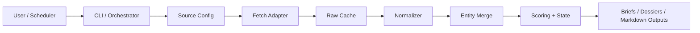

# web3-opportunity-scout

[中文](README.zh.md)

`web3-opportunity-scout` is a production-oriented skill for discovering early Web3 opportunities from configurable data sources.

The current repository already supports a full single-source MVP around RootData:

- fetch source data
- cache raw payloads
- normalize project records
- filter records by stream profile
- merge repeated entities
- score opportunities
- build ranked outputs, briefs, theses, dossiers, and state updates

It is designed for:

- interactive opportunity queries
- scheduled recurring digests
- future multi-source expansion through source adapters

### Quick Start

```bash
python3 -m venv .venv
source .venv/bin/activate
pip install -r requirements.txt
cp .env.example .env
python scripts/cli.py doctor
python scripts/cli.py init
python scripts/cli.py list-sources
python scripts/cli.py run --source rootdata_projects
```

Or use:

```bash
make venv
make install
make doctor
make list-sources
make pipeline
make test
```

### Main Outputs

- `output/ranked-opportunities.md`
- `output/raw-opportunities.md`
- `output/briefs/latest-brief.html`
- `output/briefs/latest-brief.md`
- `output/briefs/latest-brief.en.md`
- `output/briefs/latest-brief.zh.md`
- `output/project-theses/`
- `output/project-dossiers.json`
- `state/watchlist.json`
- `state/project-dossiers.json`
- `state/run-state.json`

### Current Architecture



The current implementation keeps deterministic processing in code and reserves narrative explanation for downstream model-facing artifacts.

### Code Map

```text
web3-opportunity-scout/
├── README.md
├── AGENTS.md
├── Makefile
├── config.example.yaml
├── sources.example.yaml
├── docs/                     # public product docs
├── internal/                 # private progress / build notes
├── prompts/
├── references/
├── scripts/
│   ├── cli.py                # unified entrypoint
│   ├── run-pipeline.py       # orchestrates end-to-end pipeline
│   ├── fetch-*.py            # source fetch adapters
│   ├── normalize-*.py        # source normalizers
│   ├── filter-candidates.py  # profile-based post-normalize filtering
│   ├── merge-project-entities.py
│   ├── score-opportunities.py
│   ├── build-*.py            # summaries, briefs, dossiers
│   └── common.py             # shared config/state helpers
├── tests/
├── cache/
├── output/
└── state/
```

### Documentation

- Architecture: [references/architecture.md](references/architecture.md)
- Runtime contracts: [references/contracts.md](references/contracts.md)
- Source onboarding: [references/source-onboarding.md](references/source-onboarding.md)
- Host integration: [references/host-integration.md](references/host-integration.md)
- Project brief: [docs/brief.md](docs/brief.md)

### Configuration

- `config.yaml` controls focus chains, sectors, scoring thresholds, and directories.
- `sources.yaml` controls source enablement and request settings.
- Each source can declare an `adapter` that maps to `fetch-<adapter>.py` and `normalize-<adapter>.py`.
- `filters.active_profile` chooses the current stream, such as `opportunity` or `market`.
- Sources can define `filter_profiles.<profile>` overrides for source-specific second-pass filtering.
- `.env` is loaded automatically by the CLI when present.
- Empty `focus.chains` and `focus.sectors` mean market-wide scanning by default.
- `reporting.locale` supports `auto`, `en`, `zh`, and `bilingual`.
- `reporting.generate_formats` supports `html` and `md`. The recommended push artifact is `output/briefs/latest-brief.html`.

### Hermes / OpenClaw

- This repository should focus on producing stable artifacts, not owning delivery infrastructure.
- When hosted by Hermes or OpenClaw, let the host scheduler trigger `python scripts/cli.py run --source <source_id>`.
- Let the host read `output/briefs/latest-brief.html` for rich push surfaces, or `output/briefs/latest-brief.md` for plain-text / markdown channels.
- Use `reporting.locale` to choose `auto`, `en`, `zh`, or `bilingual` at artifact generation time.

More detail: [references/host-integration.md](references/host-integration.md)

### Publishing Notes

- Public docs use English primary files plus parallel Chinese `*.zh.md` files.
- Repository-internal links use relative paths for GitHub portability.
- Secrets stay in `.env` or local overrides and must not be committed.
