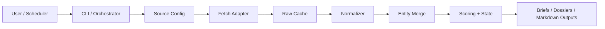
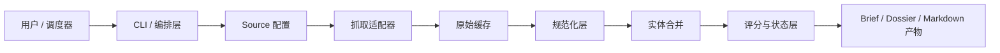

# web3-opportunity-scout

[English](#english) | [中文](#zh)

<a id="english"></a>
## English

`web3-opportunity-scout` is a production-oriented skill for discovering early Web3 opportunities from configurable data sources.

The current repository already supports a full single-source MVP around RootData:

- fetch source data
- cache raw payloads
- normalize project records
- merge repeated entities
- score opportunities
- build ranked outputs, briefs, theses, dossiers, and state updates

It is designed for:

- interactive opportunity queries
- scheduled recurring digests
- future multi-source expansion through source adapters

Switch language: [中文](#zh)

### Quick Start

```bash
python3 -m venv .venv
source .venv/bin/activate
pip install -r requirements.txt
cp .env.example .env
python scripts/cli.py doctor
python scripts/cli.py init
python scripts/cli.py list-sources
python scripts/cli.py run --source rootdata_projects
```

Or use:

```bash
make venv
make install
make doctor
make list-sources
make pipeline
make test
```

### Main Outputs

- `output/ranked-opportunities.md`
- `output/raw-opportunities.md`
- `output/briefs/latest-brief.html`
- `output/briefs/latest-brief.md`
- `output/briefs/latest-brief.en.md`
- `output/briefs/latest-brief.zh.md`
- `output/project-theses/`
- `output/project-dossiers.json`
- `state/watchlist.json`
- `state/project-dossiers.json`
- `state/run-state.json`

### Current Architecture



The current implementation keeps deterministic processing in code and reserves narrative explanation for downstream model-facing artifacts.

### Code Map

```text
web3-opportunity-scout/
├── README.md
├── AGENTS.md
├── Makefile
├── config.example.yaml
├── sources.example.yaml
├── docs/                     # public product docs
├── internal/                 # private progress / build notes
├── prompts/
├── references/
├── scripts/
│   ├── cli.py                # unified entrypoint
│   ├── run-pipeline.py       # orchestrates end-to-end pipeline
│   ├── fetch-*.py            # source fetch adapters
│   ├── normalize-*.py        # source normalizers
│   ├── merge-project-entities.py
│   ├── score-opportunities.py
│   ├── build-*.py            # summaries, briefs, dossiers
│   └── common.py             # shared config/state helpers
├── tests/
├── cache/
├── output/
└── state/
```

### Documentation

- Architecture: [references/architecture.md#english](references/architecture.md#english)
- Runtime contracts: [references/contracts.md#english](references/contracts.md#english)
- Source onboarding: [references/source-onboarding.md#english](references/source-onboarding.md#english)
- Project brief: [docs/brief.md#english](docs/brief.md#english)

### Configuration

- `config.yaml` controls focus chains, sectors, scoring thresholds, and directories.
- `sources.yaml` controls source enablement and request settings.
- Each source can declare an `adapter` that maps to `fetch-<adapter>.py` and `normalize-<adapter>.py`.
- `.env` is loaded automatically by the CLI when present.
- `reporting.locale` supports `auto`, `en`, `zh`, and `bilingual`.
- `reporting.generate_formats` supports `html` and `md`. The recommended push artifact is `output/briefs/latest-brief.html`.

### Publishing Notes

- Public docs are kept in single-file bilingual format with anchor links.
- Repository-internal links use relative paths for GitHub portability.
- Secrets stay in `.env` or local overrides and must not be committed.

---

<a id="zh"></a>
## 中文

`web3-opportunity-scout` 是一个面向生产环境的 Web3 早期机会发现 skill，用来从可配置的数据源中稳定产出高价值项目机会线索。

当前仓库已经支持一个围绕 RootData 的完整单源 MVP：

- 抓取来源数据
- 缓存原始 payload
- 规范化项目记录
- 合并重复实体
- 机会评分
- 产出排序结果、brief、thesis、dossier 和状态更新

它面向的使用场景包括：

- 对话式机会查询
- 定时机会推送
- 通过 source adapter 持续扩展为多源系统

切换语言: [English](#english)

### 快速开始

```bash
python3 -m venv .venv
source .venv/bin/activate
pip install -r requirements.txt
cp .env.example .env
python scripts/cli.py doctor
python scripts/cli.py init
python scripts/cli.py list-sources
python scripts/cli.py run --source rootdata_projects
```

也可以直接使用：

```bash
make venv
make install
make doctor
make list-sources
make pipeline
make test
```

### 主要产物

- `output/ranked-opportunities.md`
- `output/raw-opportunities.md`
- `output/briefs/latest-brief.html`
- `output/briefs/latest-brief.md`
- `output/briefs/latest-brief.en.md`
- `output/briefs/latest-brief.zh.md`
- `output/project-theses/`
- `output/project-dossiers.json`
- `state/watchlist.json`
- `state/project-dossiers.json`
- `state/run-state.json`

### 当前架构



当前实现坚持“确定性处理优先，模型判断后置”的原则，先把抓取、规范化、去重、状态管理做扎实，再向后构建可解释输出。

### 代码结构

```text
web3-opportunity-scout/
├── README.md
├── AGENTS.md
├── Makefile
├── config.example.yaml
├── sources.example.yaml
├── docs/                     # 对外公开文档
├── internal/                 # 内部进度与构建记录
├── prompts/
├── references/
├── scripts/
│   ├── cli.py                # 统一入口
│   ├── run-pipeline.py       # 串起完整流水线
│   ├── fetch-*.py            # source 抓取适配器
│   ├── normalize-*.py        # source 规范化适配器
│   ├── merge-project-entities.py
│   ├── score-opportunities.py
│   ├── build-*.py            # summary / brief / dossier 产出
│   └── common.py             # 公共配置与状态工具
├── tests/
├── cache/
├── output/
└── state/
```

### 文档入口

- 架构设计: [references/architecture.md#zh](references/architecture.md#zh)
- 运行时 contract: [references/contracts.md#zh](references/contracts.md#zh)
- Source 接入指南: [references/source-onboarding.md#zh](references/source-onboarding.md#zh)
- 项目简介: [docs/brief.md#zh](docs/brief.md#zh)

### 配置说明

- `config.yaml` 控制关注链、赛道、评分阈值和目录位置。
- `sources.yaml` 控制 source 启用状态和请求配置。
- 每个 source 都可以声明一个 `adapter`，映射到 `fetch-<adapter>.py` 和 `normalize-<adapter>.py`。
- 当 `.env` 存在时，CLI 会自动加载其中的环境变量。
- `reporting.locale` 支持 `auto`、`en`、`zh`、`bilingual`。
- `reporting.generate_formats` 支持 `html` 和 `md`，其中推荐用于推送展示的是 `output/briefs/latest-brief.html`。

### 发布说明

- 对外文档统一使用单文件双语结构，并通过 anchor 在中英文之间跳转。
- 仓库内部文档链接统一使用相对路径，方便直接发布到 GitHub。
- Secret 只允许放在 `.env` 或本地未跟踪覆盖文件中，不能提交进版本库。
