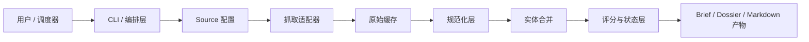

# web3-opportunity-scout

[English](README.md)

`web3-opportunity-scout` 是一个面向生产环境的 Web3 早期机会发现 skill，用来从可配置的数据源中稳定产出高价值项目机会线索。

当前仓库已经支持一个围绕 RootData 的完整单源 MVP：

- 抓取来源数据
- 缓存原始 payload
- 规范化项目记录
- 合并重复实体
- 机会评分
- 产出排序结果、brief、thesis、dossier 和状态更新

它面向的使用场景包括：

- 对话式机会查询
- 定时机会推送
- 通过 source adapter 持续扩展为多源系统

### 快速开始

```bash
python3 -m venv .venv
source .venv/bin/activate
pip install -r requirements.txt
cp .env.example .env
python scripts/cli.py doctor
python scripts/cli.py init
python scripts/cli.py list-sources
python scripts/cli.py run --source rootdata_projects
```

也可以直接使用：

```bash
make venv
make install
make doctor
make list-sources
make pipeline
make test
```

### 主要产物

- `output/ranked-opportunities.md`
- `output/raw-opportunities.md`
- `output/briefs/latest-brief.html`
- `output/briefs/latest-brief.md`
- `output/briefs/latest-brief.en.md`
- `output/briefs/latest-brief.zh.md`
- `output/project-theses/`
- `output/project-dossiers.json`
- `state/watchlist.json`
- `state/project-dossiers.json`
- `state/run-state.json`

### 当前架构



当前实现坚持“确定性处理优先，模型判断后置”的原则，先把抓取、规范化、去重、状态管理做扎实，再向后构建可解释输出。

### 代码结构

```text
web3-opportunity-scout/
├── README.md
├── README.zh.md
├── AGENTS.md
├── Makefile
├── config.example.yaml
├── sources.example.yaml
├── docs/                     # 对外公开文档
├── internal/                 # 内部进度与构建记录
├── prompts/
├── references/
├── scripts/
│   ├── cli.py                # 统一入口
│   ├── run-pipeline.py       # 串起完整流水线
│   ├── fetch-*.py            # source 抓取适配器
│   ├── normalize-*.py        # source 规范化适配器
│   ├── merge-project-entities.py
│   ├── score-opportunities.py
│   ├── build-*.py            # summary / brief / dossier 产出
│   └── common.py             # 公共配置与状态工具
├── tests/
├── cache/
├── output/
└── state/
```

### 文档入口

- 架构设计: [references/architecture.zh.md](references/architecture.zh.md)
- 运行时 contract: [references/contracts.zh.md](references/contracts.zh.md)
- Source 接入指南: [references/source-onboarding.zh.md](references/source-onboarding.zh.md)
- Host 集成: [references/host-integration.zh.md](references/host-integration.zh.md)
- 项目简介: [docs/brief.zh.md](docs/brief.zh.md)

### 配置说明

- `config.yaml` 控制关注链、赛道、评分阈值和目录位置。
- `sources.yaml` 控制 source 启用状态和请求配置。
- 每个 source 都可以声明一个 `adapter`，映射到 `fetch-<adapter>.py` 和 `normalize-<adapter>.py`。
- 当 `.env` 存在时，CLI 会自动加载其中的环境变量。
- 当 `focus.chains` 和 `focus.sectors` 为空时，默认执行全市场扫描。
- `reporting.locale` 支持 `auto`、`en`、`zh`、`bilingual`。
- `reporting.generate_formats` 支持 `html` 和 `md`，其中推荐用于推送展示的是 `output/briefs/latest-brief.html`。

### Hermes / OpenClaw 集成

- 这个仓库当前更适合专注在“稳定产出内容”，而不是自己实现推送基础设施。
- 如果由 Hermes 或 OpenClaw 托管，建议由宿主的调度器触发 `python scripts/cli.py run --source <source_id>`。
- 宿主侧读取 `output/briefs/latest-brief.html` 作为富展示推送产物，或者读取 `output/briefs/latest-brief.md` 作为纯文本 / Markdown 推送产物。
- 最终产物语言通过 `reporting.locale` 控制，可选 `auto`、`en`、`zh`、`bilingual`。

更多说明见: [references/host-integration.zh.md](references/host-integration.zh.md)

### 发布说明

- 对外文档使用英文主文件和中文 `*.zh.md` 配对文件。
- 仓库内部文档链接统一使用相对路径，方便直接发布到 GitHub。
- Secret 只允许放在 `.env` 或本地未跟踪覆盖文件中，不能提交进版本库。
