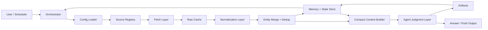
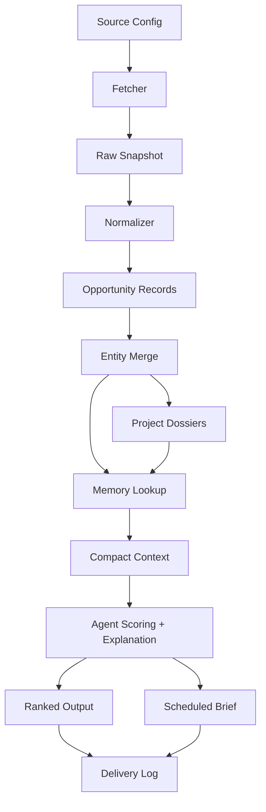

# System Architecture

This document defines the target architecture for `web3-opportunity-scout` as a production-grade, multi-source, stateful opportunity discovery skill.

## Goals

The system should support all of the following at the same time:

- ad hoc conversational requests such as "find early Solana infra projects"
- follow-up questions such as financing status, participation angle, or why a project matters
- scheduled push workflows such as morning briefs or every-N-hours refreshes
- user-extensible source configuration without rewriting core logic
- recovery from partial runs, source failures, and interrupted pipelines
- durable memory so already-pushed projects are not repeatedly treated as fresh

## Design Principles

1. Separate deterministic data work from model judgment.
   Source fetching, parsing, normalization, deduplication, and state transitions should be deterministic. The model should focus on ranking, explanation, thesis formation, and answering user questions.

2. Model inputs must stay compact and structured.
   Large raw pages or noisy social feeds should not be passed directly into the model. Convert them into normalized records and compact evidence bundles first.

3. Every opportunity must remain traceable.
   Outputs should preserve raw source references, extraction timestamps, and merge lineage so users can inspect why the system surfaced something.

4. The system should be both pull-first and push-capable.
   The same core pipeline should support interactive queries and scheduled delivery instead of maintaining two separate stacks.

5. State is a product feature, not an implementation detail.
   Watchlist memory, event memory, run checkpoints, and delivery history are necessary for quality, not optional add-ons.

## System Overview



## Major Components

### 1. Orchestrator

The orchestrator is the control plane for every run.

Responsibilities:

- detect whether the run is interactive or scheduled
- load effective config and source definitions
- decide which pipeline stages are needed
- resume from checkpoints when possible
- manage source-level failures and retries
- route final outputs to either chat responses or scheduled push artifacts

The orchestrator should follow a stage-based execution model, inspired by reliable agent systems:

- plan the run scope
- execute deterministic stages
- build compact context
- invoke judgment
- persist outputs and memory

### 2. Config Loader

This layer resolves runtime configuration from:

1. runtime arguments or task overrides
2. `config.yaml`
3. `config.example.yaml`

It should also resolve source definitions from:

1. `sources.yaml`
2. `sources.example.yaml`

Config concerns include:

- focus chains and sectors
- user risk profile
- run mode such as resume or force
- output and state directories
- scheduling preferences
- source failure policy
- deduplication and novelty windows

### 3. Source Registry

The source registry makes source onboarding declarative instead of prompt-driven.

Each source definition should describe:

- unique id
- category
- fetch type
- cadence
- enabled flag
- required credentials
- parsing notes
- default trust level
- rate-limit hints

Recommended source categories:

- `official`: project blogs, launch posts, docs updates
- `social`: OpenTwitter, curated lists, founder or builder posts
- `discovery`: OpenNews, Surf, RootData, ecosystem trackers, repo search
- `builder`: hackathons, demo days, grants, ecosystem showcases
- `market`: fundraising signals, listings, on-chain traction snapshots

This design lets users add or remove sources by editing configuration rather than changing prompts.

### 4. Fetch Layer

The fetch layer contains source-specific collectors such as:

- `fetch-opennews.py`
- `fetch-opentwitter.py`
- `fetch-surf.py`
- `fetch-rootdata.py`
- `fetch-blockbeats.py`

Fetcher responsibilities:

- read source config
- collect raw source payloads
- persist immutable raw snapshots
- annotate fetch metadata
- report partial success or failure

Fetcher outputs should be stored under date-partitioned raw caches so future debugging and reprocessing are possible without immediately hitting the source again.

### 5. Raw Cache

The raw cache is the boundary between external volatility and internal repeatability.

Store:

- raw API responses
- HTML snapshots or extracted text
- fetch metadata such as timestamps, parameters, and source ids
- source-level errors

Why it matters:

- supports replay and normalization changes
- reduces source re-fetch pressure
- allows forensic inspection when a result looks wrong

### 6. Normalization Layer

This is the most important deterministic layer.

All sources should converge toward a unified `opportunity record`, for example:

```text
id
entity_key
source_id
source_type
project_name
project_url
summary
category
chains
tags
signals
published_at
observed_at
confidence
raw_ref
status
```

Normalization responsibilities:

- clean noisy source payloads
- extract project candidates
- map source-specific fields into shared schema
- produce structured signals rather than prose blobs
- label confidence and extraction ambiguity

### 7. Entity Merge And Dedup

Different sources will mention the same project in different ways. This layer creates a stable project identity.

Responsibilities:

- merge aliases and domains
- unify project records across sources
- distinguish new entities from new events on known entities
- prevent repeated "new opportunity" alerts for unchanged projects

This layer should write to durable memory, not just in-memory session state.

### 8. Memory And State Store

This is the state backbone of the project.

Recommended state objects:

- `event-memory.json`
  Stores previously observed signals and event fingerprints.
- `watchlist.json`
  Stores actively tracked projects and why they matter.
- `delivery-log.json`
  Stores what was already pushed to the user, when, and in which format.
- `run-state.json`
  Stores stage checkpoints, run ids, failures, and resume metadata.
- `project-dossiers.json`
  Stores accumulated project-level summaries and evidence history.

This state enables:

- novelty scoring
- deduplication across days
- follow-up questioning in chat
- scheduled delivery without spam

### 9. Compact Context Builder

This layer transforms merged project records plus prior memory into model-ready evidence packets.

Each compact context bundle should include:

- canonical project identity
- short factual summary
- key supporting signals
- why it might be early
- what the system already knows
- whether it was recently pushed
- unresolved questions or missing evidence

The point is to keep model context small, high-signal, and explainable.

### 10. Agent Judgment Layer

This is where the model adds value.

The agent should:

- score opportunities using novelty, traction, and asymmetry
- explain why a project matters now
- answer user-specific questions such as funding status or participation angle
- produce ranked shortlists and follow-up suggestions
- adapt output style to interactive or scheduled mode

The agent should not:

- parse large raw source dumps directly
- invent missing evidence
- treat unverified mentions as confirmed facts

### 11. Artifact Layer

Recommended output artifacts:

- `output/raw-opportunities.md`
- `output/ranked-opportunities.md`
- `output/project-dossiers.json`
- `output/briefs/YYYY-MM-DD-am.md`
- `output/briefs/YYYY-MM-DD-pm.md`

Artifacts are for both human review and downstream automation.

## Interaction Modes

### Interactive Pull Mode

Used when the user asks a live question in chat.

Example:

- "Find early Base AI x crypto projects"
- "Which of these raised money"
- "How can I participate in this one"

Flow:

1. interpret the request scope
2. inspect prior state and recent artifacts
3. decide whether incremental refresh is enough
4. fetch only relevant sources when necessary
5. normalize, merge, and rank
6. answer with citations and state-aware reasoning

Interactive mode should prefer fast incremental refresh over full pipeline reruns.

### Scheduled Push Mode

Used for recurring delivery such as morning digests or every 4 hours refreshes.

Flow:

1. scheduler triggers a run with a saved profile
2. orchestrator loads focus and cadence rules
3. pipeline refreshes sources
4. state layer filters already-delivered opportunities
5. agent composes a concise push artifact
6. delivery log records exactly what was sent

This mode needs strong novelty gating to avoid repetitive pushes.

## Scheduling Model

Scheduling should be a thin trigger layer over the same orchestrator.

Recommended schedule object fields:

- `schedule_id`
- `profile_name`
- `cron` or interval
- `focus_override`
- `delivery_channel`
- `novelty_threshold`
- `max_items`
- `enabled`

The scheduler itself should not contain business logic. It should only create runs.

## Data Flow



## Failure And Recovery Model

The architecture should treat runs as resumable units.

Stages should be checkpointed:

1. config resolved
2. sources selected
3. fetch complete
4. normalization complete
5. entity merge complete
6. context built
7. ranking complete
8. memory persisted
9. delivery persisted

Run statuses should include:

- `pending`
- `running`
- `partial`
- `completed`
- `failed`
- `cancelled`

Recovery rules:

- if fetch partially fails, continue only when policy allows it
- if normalization fails for one source, preserve successful source outputs
- if ranking fails, do not lose normalized and merged artifacts
- if delivery fails, preserve ranked results and retry only the delivery step

## User-Configurable Source Extensibility

To keep the skill extensible, source onboarding should require:

1. a source entry in `sources.yaml`
2. a matching fetch adapter
3. a normalizer or source mapping rule
4. optional source-specific scoring hints

This keeps the core orchestration stable while sources evolve independently.

## Suggested Internal Interfaces

The project can evolve around these conceptual interfaces:

- `SourceAdapter`: fetch raw payloads from one source
- `Normalizer`: map one source into shared opportunity records
- `EntityResolver`: merge candidates into canonical projects
- `MemoryStore`: read and write state objects
- `ContextBuilder`: build compact evidence bundles
- `OpportunityJudge`: produce ranking and explanation
- `DeliveryAdapter`: send or render outputs for chat or schedules

## Harness-Inspired Thinking

A useful mental model is:

- deterministic tools do the heavy lifting
- the agent acts as a planner, judge, and explainer
- state is explicit and durable
- long workflows are resumable

In practice, that means this project should behave less like "one prompt that reads feeds" and more like "an opportunity operating system" with a model-centered decision layer.

## Recommended Near-Term Build Order

1. finalize schema and run-state contracts
2. add `init.py` and `check-run-state.py`
3. implement 1 to 2 high-value fetchers first
4. implement shared normalization and merge pipeline
5. implement memory store and delivery log
6. implement compact context builder
7. implement ranking and chat-answer composition
8. add scheduling integration
