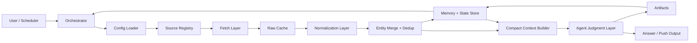

# System Architecture

[中文](architecture.zh.md)

This document defines the target architecture for `web3-opportunity-scout` as a production-grade, multi-source, stateful opportunity discovery skill.

### Goals

- ad hoc conversational requests
- follow-up questions about financing, participation, or significance
- scheduled push workflows
- user-extensible source configuration
- recovery from partial runs and source failures
- durable memory and deduplication

### Design Principles

1. Separate deterministic data work from model judgment.
2. Keep model inputs compact and structured.
3. Preserve source traceability.
4. Share one pipeline across pull and push modes.
5. Treat state as a product feature.

### System Overview

### Core Layers

- `Source Registry`: declarative source definitions
- `Fetch Layer`: source-specific collectors
- `Raw Cache`: immutable source payloads
- `Normalization Layer`: unified opportunity schema
- `Entity Merge`: canonical project identity
- `Memory + State`: deduplication, watchlists, delivery history
- `Compact Context`: model-ready evidence packets
- `Agent Judgment`: ranking, explanation, thesis
