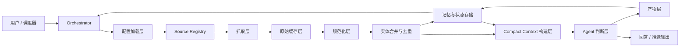
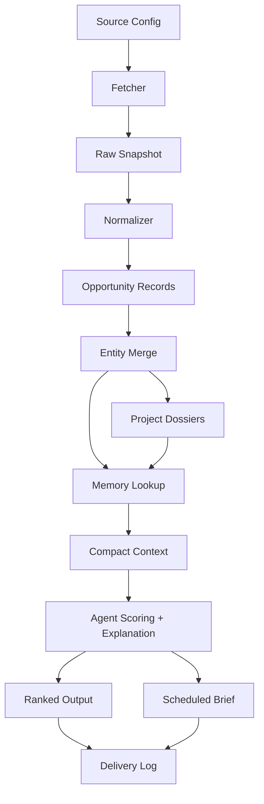

# 系统架构设计

这份文档定义了 `web3-opportunity-scout` 的目标架构：一个面向生产环境、支持多数据源、带持久状态的 Web3 早期机会发现 skill。

## 目标

系统需要同时支持下面几类能力：

- 在对话里临时发起查询，比如“找一下 Solana infra 的早期项目”
- 对同一批项目继续追问，比如融资情况、参与角度、为什么值得关注
- 定时推送，比如每天早上推一版，或者每隔几小时刷新一版
- 用户通过配置增加或关闭数据源，而不是每次改 prompt
- 支持部分失败、补跑恢复、中断重试
- 保留跨天记忆，避免已经推送过的项目反复被当成新机会

## 设计原则

1. 确定性数据处理和模型判断分层。
   抓取、解析、规范化、去重、状态切换这些工作应该尽量是确定性的；模型主要负责排序、解释、形成 thesis、回答用户问题。

2. 模型输入必须紧凑且结构化。
   不能把大段原始网页、社交噪音流直接丢给模型。应该先压成统一 record 和 compact evidence bundle。

3. 每条机会线索都必须可追溯。
   最终输出要能回溯到原始来源、抓取时间、合并链路，方便用户理解为什么会被系统挑出来。

4. 同一套核心流水线同时服务 pull 和 push。
   交互式查询和定时推送不应该各写一套逻辑，而应该共享一套 orchestrator 和 pipeline。

5. 状态层是产品能力，不是附属实现细节。
   watchlist、event memory、run checkpoint、delivery history 都是质量能力的一部分。

## 系统总览



## 核心组件

### 1. Orchestrator

Orchestrator 是整个系统的控制平面。

职责包括：

- 识别当前 run 是交互式还是定时式
- 加载有效配置和 source 定义
- 判断本次要执行哪些 stage
- 尽可能从 checkpoint 恢复
- 管理来源级别的失败和重试
- 把最终结果路由到聊天回复或定时推送产物

它最好采用一种 stage-based 的执行方式，比较接近可靠 agent 系统的思路：

- 先规划本次 run scope
- 再执行确定性 stage
- 再构建 compact context
- 再调用判断层
- 最后落地产物和状态

### 2. 配置加载层

这一层负责解析运行时配置，建议优先级如下：

1. 本次运行的参数覆盖
2. `config.yaml`
3. `config.example.yaml`

source 定义同理：

1. `sources.yaml`
2. `sources.example.yaml`

配置应该覆盖这些维度：

- 关注的链和赛道
- 用户风险偏好
- run 模式，比如 resume 或 force
- output / cache / state 目录
- 调度偏好
- source 失败策略
- 去重窗口和 novelty 窗口

### 3. Source Registry

Source Registry 的目标，是让 source onboarding 走声明式配置，而不是写死在 prompt 里。

每个 source 定义建议至少包含：

- 唯一 id
- 来源分类
- 抓取类型
- 更新频率
- 是否启用
- 是否依赖凭证
- 解析说明
- 默认可信度
- 速率限制提示

推荐的 source 分类：

- `official`：项目博客、发版公告、文档更新
- `social`：OpenTwitter、curated list、创始人和 builder 帖子
- `discovery`：OpenNews、Surf、RootData、生态追踪器、repo 搜索
- `builder`：黑客松、demo day、grant、公链 showcase
- `market`：融资信号、上架信号、链上 traction 快照

这样用户只需要改配置，就能增删来源，而不用反复重写 prompt。

### 4. 抓取层

抓取层由 source-specific 的 collector 组成，例如：

- `fetch-opennews.py`
- `fetch-opentwitter.py`
- `fetch-surf.py`
- `fetch-rootdata.py`
- `fetch-blockbeats.py`

Fetcher 的职责：

- 读取 source config
- 拉取原始 payload
- 持久化不可变 raw snapshot
- 附带抓取元数据
- 回报部分成功或失败状态

抓取结果建议按日期分区落到 raw cache 中，这样以后即使解析逻辑变了，也能直接重放，不需要立刻重新打 source。

### 5. 原始缓存层

原始缓存层是“外部波动”和“内部可复现性”之间的边界。

建议保存：

- 原始 API 返回
- HTML 快照或抽取后的正文
- 抓取元数据，比如时间、参数、source id
- source 级报错信息

它的重要性在于：

- 支持 replay 和 normalize 逻辑升级
- 降低重复抓 source 的压力
- 当结果异常时便于回溯排查

### 6. 规范化层

这是最关键的确定性层。

所有来源最终都应该被映射到统一的 `opportunity record`，例如：

```text
id
entity_key
source_id
source_type
project_name
project_url
summary
category
chains
tags
signals
published_at
observed_at
confidence
raw_ref
status
```

规范化层负责：

- 清洗 noisy payload
- 抽取项目候选
- 把来源字段映射到统一 schema
- 把信号整理成结构化字段，而不是长 prose
- 标记 confidence 和解析歧义

### 7. 实体合并与去重

不同来源会用不同方式提到同一个项目，这一层的目标是建立稳定的项目身份。

职责包括：

- 合并 alias、域名、社媒账号等线索
- 跨来源统一项目记录
- 区分“新项目”和“老项目上的新事件”
- 避免把没变化的项目反复当作新机会推送

这一层应该写入持久 memory，而不是只存在当前进程内存里。

### 8. 记忆与状态存储

这是整个系统的状态骨架。

建议至少维护这些状态对象：

- `event-memory.json`
  记录历史观测到的事件和事件指纹。
- `watchlist.json`
  记录当前持续关注的项目，以及为什么值得跟。
- `delivery-log.json`
  记录哪些内容已经推给用户、什么时候推的、以什么形式推的。
- `run-state.json`
  记录 stage checkpoint、run id、失败原因、恢复信息。
- `project-dossiers.json`
  记录项目级别的累计摘要和证据历史。

这一层支撑的关键能力包括：

- novelty 评分
- 跨天去重
- 对话里的追问回答
- 定时推送去重防刷屏

### 9. Compact Context 构建层

这一层负责把“合并后的项目记录 + 历史记忆”压成适合模型消费的 evidence packet。

每个 compact context bundle 建议包含：

- 项目的 canonical identity
- 简短事实摘要
- 核心支持信号
- 为什么它可能还处于早期
- 系统之前已经知道什么
- 最近是否推送过
- 还缺哪些证据，或者有哪些未解问题

目标就是让模型看到的是小而精、高信号、可解释的上下文。

### 10. Agent 判断层

这是模型真正发挥价值的地方。

Agent 应该负责：

- 按 novelty、traction、asymmetry 进行机会评分
- 解释为什么它现在值得关注
- 回答用户问题，比如融资情况、参与角度
- 生成 shortlist、排序结果和下一步建议
- 根据交互模式或推送模式调整输出形式

Agent 不应该负责：

- 直接解析大段原始 source dump
- 凭空补事实
- 把未经验证的提及当成确定信息

### 11. 产物层

建议的输出产物包括：

- `output/raw-opportunities.md`
- `output/ranked-opportunities.md`
- `output/project-dossiers.json`
- `output/briefs/YYYY-MM-DD-am.md`
- `output/briefs/YYYY-MM-DD-pm.md`

这些产物既服务人工复核，也服务后续自动化流程。

## 交互模式

### 交互式 Pull Mode

用于用户在聊天里直接提问。

例如：

- “找一下 Base 上早期的 AI x crypto 项目”
- “这些里面哪些融过资”
- “这个项目我可以怎么参与”

建议流程：

1. 解析本次问题的 scope
2. 查看已有状态和最近产物
3. 判断是否只需要增量刷新
4. 只抓取必要来源
5. 规范化、合并、排序
6. 结合状态和引用给出回答

交互模式要优先追求“快速增量刷新”，而不是每次全量重跑。

### 定时 Push Mode

用于早报、午报、每 4 小时刷新这类定时交付。

建议流程：

1. 调度器按 profile 触发 run
2. orchestrator 加载 focus 和 cadence 规则
3. 流水线刷新来源
4. 状态层过滤已经推送过的机会
5. agent 生成精简版推送产物
6. delivery log 记录本次实际发出的内容

这一模式必须有严格的 novelty gating，否则会反复推相似内容。

## 调度模型

调度层本身应该很薄，只负责触发同一套 orchestrator。

一个 schedule object 建议至少包含：

- `schedule_id`
- `profile_name`
- `cron` 或 interval
- `focus_override`
- `delivery_channel`
- `novelty_threshold`
- `max_items`
- `enabled`

调度器本身不要承载业务判断，它只负责创建 run。

## 数据流



## 失败与恢复模型

系统应该把每次 run 看成可恢复的执行单元。

建议 checkpoint 的 stage：

1. config resolved
2. sources selected
3. fetch complete
4. normalization complete
5. entity merge complete
6. context built
7. ranking complete
8. memory persisted
9. delivery persisted

run status 建议包括：

- `pending`
- `running`
- `partial`
- `completed`
- `failed`
- `cancelled`

恢复规则建议如下：

- fetch 部分失败时，只在策略允许的情况下继续
- 某个 source 的 normalize 失败时，保留其他 source 的成功结果
- ranking 失败时，不要丢失已经完成的 normalize 和 merge 产物
- delivery 失败时，保留 ranked 结果，只重试投递步骤

## 用户可扩展来源机制

为了让 skill 可以稳定扩展，新增来源最好满足这四个条件：

1. 在 `sources.yaml` 中新增一条 source entry
2. 增加一个对应的 fetch adapter
3. 增加一个 normalizer 或映射规则
4. 可选地配置 source-specific 的 scoring hint

这样核心 orchestration 不需要频繁变化，来源层可以独立演进。

## 建议的内部接口

项目后续可以围绕这些概念接口演进：

- `SourceAdapter`：从单个来源拉取 raw payload
- `Normalizer`：把单个来源映射成统一 opportunity record
- `EntityResolver`：把候选记录合并成 canonical project
- `MemoryStore`：读写状态对象
- `ContextBuilder`：构建 compact evidence bundle
- `OpportunityJudge`：输出排序和解释
- `DeliveryAdapter`：为聊天或定时任务渲染 / 投递结果

## 借鉴 Harness 风格的思路

一个比较合适的心智模型是：

- 确定性工具负责重活
- agent 负责规划、判断、解释
- 状态是显式且持久的
- 长流程必须支持恢复

换句话说，这个项目最终不应该只是“一个会读资讯流的 prompt”，而更像是一个带模型判断层的 opportunity operating system。

## 近期推荐实现顺序

1. 先定 schema 和 run-state contract
2. 补 `init.py` 和 `check-run-state.py`
3. 先实现 1 到 2 个高价值 fetcher
4. 再实现共享 normalize 和 merge 流水线
5. 再补 memory store 和 delivery log
6. 再实现 compact context builder
7. 再实现 ranking 和 chat answer composition
8. 最后接调度能力
