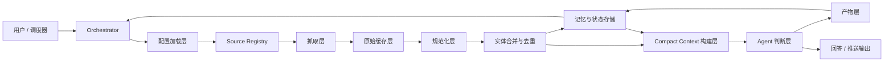

# System Architecture

[English](architecture.md)

这份文档定义了 `web3-opportunity-scout` 的目标架构：一个面向生产环境、支持多数据源、带持久状态的 Web3 早期机会发现 skill。

### 目标

- 支持临时对话式查询
- 支持围绕融资、参与角度、意义的继续追问
- 支持定时推送
- 支持用户通过配置扩展 source
- 支持部分失败、补跑恢复
- 支持持久记忆和去重

### 设计原则

1. 确定性数据处理和模型判断分层。
2. 模型输入保持紧凑和结构化。
3. 每条机会线索都可追溯。
4. pull 和 push 共享同一套流水线。
5. 状态层是产品能力，不是附属实现。

### 系统总览

### 核心分层

- `Source Registry`：声明式 source 定义
- `抓取层`：source-specific collector
- `原始缓存层`：不可变 source payload
- `规范化层`：统一 opportunity schema
- `实体合并层`：canonical project identity
- `记忆与状态层`：去重、watchlist、delivery history
- `Compact Context`：模型可消费的证据包
- `Agent 判断层`：排序、解释、thesis
